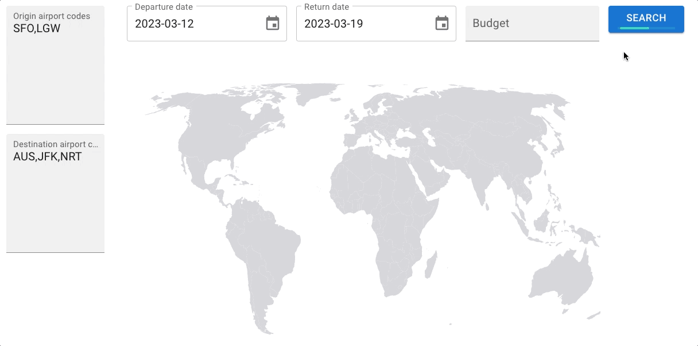

# offsites-rec

Uses the [Skyscanner API](https://rapidapi.com/3b-data-3b-data-default/api/skyscanner44/) to get flight details for easier offsite location recommendations.

## Web application

Given the following:
* Origin airport codes
* Destination airport codes
* Departure and return dates
* Budget (per person/origin airport code)

The web application will provide information on:
* Total cost of the flights (on marker hover)
* Budget restrictions:
    * Green: within budget
    * Amber: close to budget (can be within or outside)
    * Red: out of budget

### Demo



More information [here](./web-app/README.md).

### How to run
```
npm run start
```

### Tests
```
npm run test:web-app
```

## Script

### Configuration
Copy the .env-example file and fill in the missing API key.

### How to run
Run the script to get the averages for multiple flights with the following format:
```
npm run getFlights "[<ORIGIN>]" "<DESTINATION>" "<DEPARTURE_DATE>" "<RETURN_DATE>"
// e.g. npm run getFlights "[NYCA,LGW,MAD]" "OPO" "2023-05-15" "2023-05-19"
```

Run the script to get the averages for one flight with the following format:
```
npm run getFlight "<ORIGIN>" "<DESTINATION>" "<DEPARTURE_DATE>" "<RETURN_DATE>"
// e.g. npm run getFlight "NYCA" "OPO" "2023-05-15" "2023-05-19"
```

### Tests
```
npm run test:lambda
```